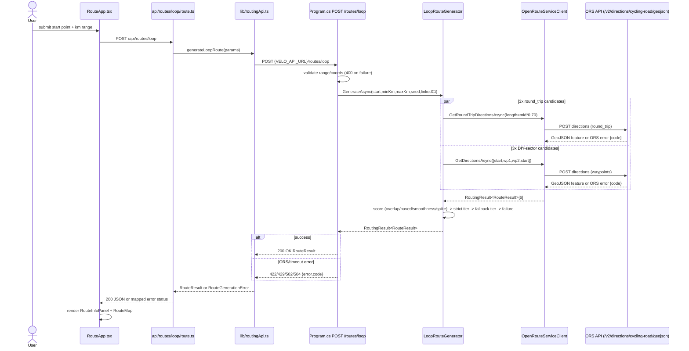

# Research: Loop-route generation flow (`POST /routes/loop`)

**Date**: 2026-09-11T15:25:23+02:00
**Researcher**: Łukasz Orawiec
**Git Commit**: `c9eb8a00e72a716877e502a19f49cf16db44fbc9`
**Branch**: `10x-architect-artifacts`
**Repository**: velo-route

## Research Question

Analyze the loop-route generation flow (`POST /routes/loop`), paying special attention to related areas defined in `context/map/repo-map.md` §4 Risk zones (`LoopRouteGenerator`/`Routing/` — highest fan-out, top-rated risk in `context/foundation/test-plan.md`). Trace the flow end-to-end with file:line and a Mermaid diagram; identify test gaps (methods/branches covered vs. not); map the blast radius (interface seam, generated layers, model, migrations, tests — static graph + git co-change). Analysis only, no refactor.

## Summary

`POST /routes/loop` (`Program.cs:380`) is the product's core feature: given a start point and a km range, it returns one loop route. The implementation is not what the folder name suggests. It is not a single algorithm with retries — it fires **6 ORS requests in parallel** (3 "round-trip" + 3 "DIY-sector" candidates), scores each on distance-fit, overlap, paved-ratio and turn-smoothness, and picks the best. This is a **deliberate correction of an earlier sequential-retry design that triggered ORS rate-limiting** — the repo's own algorithm doc is stale on this point and only its addendum matches the code (evidence, not inference — verified line-by-line against `LoopRouteGenerator.cs`).

The flow's own input validation and its ORS-error-to-HTTP-status mapping — the two things a real client actually experiences — have **zero test coverage**. The generator's scoring logic is well tested (28 active test methods across the flow); the seam that turns provider failure into an HTTP response is not.

The response contract (`RouteResult` and friends in `Routing/RouteResult.cs`) is serialized directly to the wire with no generated client and no runtime validation on the frontend — it is hand-mirrored in `src/frontend/src/types/route.ts`, and history shows at least one commit where both sides were edited by hand together (`3985e83`), with nothing but discipline (and a late-stage Playwright e2e run) to catch drift.

## Feature overview

### Sequence (frontend → backend → ORS → back)

**Frontend**
1. `RouteApp.tsx:28-58` `handleGenerate()` — form submit → `fetch('/api/routes/loop', ...)`, same-origin call to the Next.js proxy (not a direct browser→backend call).
2. `src/frontend/src/app/api/routes/loop/route.ts:4-26` — parses body, calls `generateLoopRoute(params)`.
3. `src/frontend/src/lib/routingApi.ts:16-44` `generateLoopRoute()` — server-side `POST {VELO_API_URL ?? http://localhost:5098}/routes/loop`. Non-2xx → throws `RouteGenerationError(code, message)` built from the backend's `{error, code}` body.
4. `route.ts:16-24` maps `code` → browser HTTP status: `NO_ROUTE`/`NO_VALID_RESULT`→422, `RATE_LIMITED`→429, `TIMEOUT`→504, else 502.
5. `RouteApp.tsx:42-53` — ok → `setRouteResult(result)`, renders `RouteInfoPanel` + `RouteMap`; error → sets UI error state.

**Backend entry**
6. `Program.cs:380-414` — DI-injects `LoopRouteGenerator gen` (`AddScoped`, `Program.cs:72`) and ORS options.
7. Validation: `MinKm < 5 || MaxKm > 300 || MinKm >= MaxKm` → 400 (`Program.cs:382-383`); lat/lon bounds → 400 (`Program.cs:385-386`).
8. Timeout: `CancellationTokenSource(TimeSpan.FromSeconds(orsOpts.Value.TimeoutSeconds))` linked with the request's token (`Program.cs:388-389`).
9. `gen.GenerateAsync(start, req.MinKm, req.MaxKm, req.Seed, linkedCts.Token)` (`Program.cs:394`).

**`LoopRouteGenerator.GenerateAsync` (`Routing/LoopRouteGenerator.cs`)**
10. Lines 26-38: `targetMidMeters = (minKm+maxKm)/2 * 1000`; `radius = targetMidMeters/2 * 0.45`; `baseBearing = seed % 360`.
11. `FetchCandidatesAsync` (lines 40-68) — **no sequential retries**: fires 6 concurrent ORS requests via `Task.WhenAll` — 3× `GetRoundTripDirectionsAsync` (`length = targetMidMeters * 0.70`, `points = 5`, distinct seeds) + 3× `GetDirectionsAsync` DIY-sector candidates (waypoints at 120°-spaced bearings via `WaypointCalculator.DestinationPoint`).
12. `SelectBestRoute` (lines 90-138): builds `CandidateMetrics` per candidate (`ToMetrics`, lines 78-88 — computes sharp-turn flags **once**, feeds both smoothness and spike scoring from the same array).
13. Filters to in-range distance (line 97).
14. **Strict tier** (100-106): `OverlapRatio ≤ 0.10` → order by paved% desc → smoothness desc → max-consecutive-sharp-turns asc → distance-fit asc → take first.
15. **Fallback tier** (111-126): same ordering over all in-range candidates; if the winner's overlap exceeds `OverlapDetector.Ceiling` (0.40), logs a warning and still returns success with `QualityWarning: true`.
16. **Failure** (128-137): first ORS failure's code if any candidate failed; else `"NO_VALID_RESULT"` if all 6 succeeded but none landed in range.

**ORS client (`Routing/OpenRouteServiceClient.cs`)**
17-19. Builds request via `OrsRequestFactory`, posts through `OrsHttpExecutor.PostAsync` to `POST /v2/directions/cycling-road/geojson`, `Authorization` header = raw `ORS:ApiKey`. Body includes `avoid_features: ["steps","ferries"]`, `steepness_difficulty weighting`, and for round-trip requests `options.round_trip {length, points, seed}`.
20. Resilience: `AddStandardResilienceHandler` (`Program.cs:47-58`) — retry ≤2 on 408/5xx, circuit breaker 50% failure ratio / 30s window / min throughput 3 / 30s break — wraps every ORS call.
21-24. Non-2xx → parsed `OrsErrorResponse{code,message}` → `RoutingError`; unparseable body → `RoutingError(httpStatus, ...)`; empty `Features` → `"EMPTY_RESPONSE"`; caller-token cancellation rethrown (→ the 504 in `Program.cs:410`); non-caller cancellation → `"CANCELLED"`; any other exception → `"PROVIDER_ERROR"`.
25. `OrsMapper.BuildSegments` (`OrsMapper.cs:11-43`) — unions surface/waytype span boundaries, midpoint-classifies each sub-interval, defaults unknown ORS codes to `Unknown`.
26. `RouteResult` (`RouteResult.cs:3-13`) computed properties: `PavedRatio`, `SmoothnessScore`, `OverlapRatio` (NetTopologySuite `STRtree`, ~15m buffer, directional dot-product >0.7), `QualityWarning`, `MaxConsecutiveSharpTurns` (`SpikeDetector` — a locality-aware companion to the aggregate smoothness score, so one severe local out-and-back isn't diluted away).

**Response, back through the backend**
27-29. Success → `Results.Ok(result.Value)` (`Program.cs:408`), the whole `RouteResult` serialized as the wire contract. Failure → code switch: `"2009"/"2010"`→422 `NO_ROUTE`; `"2004"`→429 `RATE_LIMITED`; `"NO_VALID_RESULT"`→422; else→502 `PROVIDER_ERROR` (`Program.cs:398-404`).
30. Outer timeout → 504 `TIMEOUT` (`Program.cs:410-413`).

**GPX export (separate, post-hoc)**
31-34. `RouteInfoPanel.handleDownload` → `/api/routes/gpx` → `Program.cs:416-429` → `GpxSerializer.Serialize` (pure string templating, no ORS/generator involvement) → browser Blob download.

**Refined by ast-grep (see Structural verification below):** "fires 6 ORS requests in parallel" is accurate at runtime but is 2 call sites, not 6 — `_client.GetRoundTripDirectionsAsync` (`LoopRouteGenerator.cs:50`) and `_client.GetDirectionsAsync` (`LoopRouteGenerator.cs:63`) are each invoked `BearingCount` (3) times via `Enumerable.Range(0,3).Select(...)`, joined by one `Task.WhenAll` (line 67).

**Deviation from docs (evidence, verified against code):** `context/foundation/loop-route-algorithm.md` lines 14-18/43-48 describe a sequential-retry strategy ("max 3 attempts"). The code implements neither retries nor that cap — it matches only the doc's own Addendum (lines 50-70), which states the retry approach was measured to trigger ORS `429`s and was replaced by the current 6-parallel-candidate design. The doc body is stale; the addendum is current and matches code exactly (bearing count, 0.70 length factor, response fields all confirmed).

**Unknowns:** whether `VELO_API_URL` resolves to `localhost:5098` vs. a deployed URL is environment-dependent, not visible in source (inference only). `IOpenRouteServiceClient.GetDirectionsAsync(start, end, ...)` 2-coordinate overload is defined but never called from production code — test-only, effectively dead code (unconfirmed as intentional vs. leftover). `routingApi.ts` also exposes `fetchRoutePreview()` hitting `/routes/preview`, which has no matching backend endpoint — appears unused/dead, unconfirmed.

## Technical debt

### 1. The scoring algorithm is well tested; the seam around it is not

28 active `[Fact]`/`[Theory]` methods exercise this flow (`LoopRouteIntegrationTests` 5, `RouteQualityTests` 9, `OrsMapperTests` 7, `OpenRouteServiceClientTests` 2, `SecurityPrivacyIntegrationTests` 2, `SpikeDetectorTests` 3), counted directly from source, not taken from prose. `OrsLiveSmokeTests` (3 methods) are `[Fact(Skip=...)]` — never run in CI.

**Zero coverage, user-facing (highest priority):**
- All 5 input-validation guard clauses on `/routes/loop` itself (`Program.cs:382-386`) — min/max km bounds, min≥max, lat/lon bounds. The sibling `/routes/gpx` endpoint's equivalent validation is fully covered by a 6-row `Theory` (`GpxEndpointTests.cs`); this endpoint's is not.
- The ORS-error-code switch (`Program.cs:398-404`): `"2009"/"2010"`→422 and `"2004"`→429 are never hit by a test. Only `"NO_VALID_RESULT"`→422 and default→502 are covered.
- `OrsHttpExecutor`'s real HTTP-error path end to end — non-2xx status, `OrsErrorResponse` deserialize, JSON-parse failure fallback, `EMPTY_RESPONSE`, non-caller `OperationCanceledException`→`"CANCELLED"`, generic exception→`"PROVIDER_ERROR"`. `OpenRouteServiceClientTests.cs`'s 2 tests only mock HTTP 200.

**Zero coverage, infra-level:**
- The retry/circuit-breaker resilience handler (`Program.cs:47-58`) never runs in any test — `TestInfrastructure.cs`'s `VeloRouteWebApplicationFactory` swaps the real `HttpClient`-backed `IOpenRouteServiceClient` for a `FakeOpenRouteServiceClient`, bypassing the handler entirely.
- Frontend: no test file exists for `/api/routes/loop/route.ts` (sibling proxies `routes/[id]`, `routes/[id]/share`, `shares/[token]` all have one), nor for `RouteApp.tsx`'s generation path or `routingApi.ts`.
- The `seed` parameter's effect on candidate bearing is untested (every test omits or nulls it).

**Cross-check against `context/foundation/test-plan.md`'s risk map:** its claimed mappings (risks #1–#6) are accurate but narrower than they read — risk #1 covers ORS *surface/roadtype* enum mapping only, not the ORS *error-code*-to-HTTP mapping above, which the plan doesn't name as a risk at all. Risk #5 (deadline) is covered only at the `Program.cs` `CancellationTokenSource` layer, not through the real resilience handler.

### 2. Hidden coupling: the response contract is hand-mirrored, unvalidated, and provably drifts

`RouteResult` (`Routing/RouteResult.cs`) **is** the `/routes/loop` HTTP response body — no separate DTO. It is manually re-declared in `src/frontend/src/types/route.ts` with no generated client (repo-wide grep found zero consumers of `/openapi/v1.json` outside Swagger UI) and no runtime validation (`routingApi.ts` does an unchecked `res.json() as Promise<RouteResult>`, no zod/io-ts/ajv anywhere in the frontend). A backend field rename/removal fails silently at runtime as `undefined`, not at compile time.

This is not hypothetical: commit `3985e83` added `PavedRatio`/`SmoothnessScore` to the backend record and, in the *same* commit, hand-added the matching fields to `route.ts` and display logic to `RouteInfoPanel.tsx`, with a manual "Touched: ..." checklist as the only enforcement. The one thing that actually catches contract drift at runtime is the Playwright e2e job in the SWA workflow (deliberately triggered on `src/backend/**` changes) — a CI-only, whole-flow backstop, not a fast local signal. Frontend unit tests never import `routingApi`/`generateLoopRoute`, so `npm test` does not catch this class of drift.

Per the connascence framing from the M4L3 lesson: this is **long-distance connascence of meaning** (backend and frontend must agree on field names/types, nothing but a late e2e run enforces it) — the more dangerous, silent kind, distinct from the cheap, compiler-caught couplings below.

### 3. Real blast radius, ranked

`RouteResult`/`RouteCoordinate`/`RouteWaySegment` etc. are the wire contract, so a change to `Routing/` ripples further than the folder name suggests.

**Cheap (compiler/CI-caught):**
- `Program.cs` — the only production file outside `Routing/` referencing it (DI wiring, endpoint signature, inline request/response records). 71% co-change (10/14 commits touching `Routing/`) — the static seam matches the co-change signal exactly.
- All of `VeloRoute.Tests/Routing/*.cs` — reachable via `InternalsVisibleTo`; `dotnet build`/`dotnet test` fails immediately on a breaking change.
- `appsettings.json` `ORS` section / `dotnet user-secrets` / Azure App Service config, if `OpenRouteServiceOptions`'s shape changes — not compiler-enforced but low-ambiguity and operational; a missing key silently defaults (e.g. `TimeoutSeconds` → 0) rather than failing loudly.

**Expensive/silent:**
- `src/frontend/src/types/route.ts` (hand-mirrored, §2) — 21% co-change but structurally certain to break silently on contract change.
- `src/frontend/src/components/RouteInfoPanel.tsx` (36% co-change) and `RouteApp.tsx` (21%) — downstream consumers of the mirrored type.
- `context/foundation/roadmap.md` and per-change docs — required by this repo's own workflow convention, enforced only by discipline.

**Confirmed non-couplings (evidence, not assumption):**
- `Migrations/` — 0/14 co-change with `Routing/` commits. `/routes/loop` never touches EF Core/Postgres, consistent with "fully anonymous, nothing persisted."
- The repo-map's claim that `TestInfrastructure.cs` is touched on >50% of `Program.cs`'s commits **does not hold specifically for `Routing/`-touching commits** — only 2/14 (14%). The 50% figure is real but driven by non-Routing Program.cs work (auth, data layer, route-library CRUD). The map's zone #2 risk is about `Program.cs` in general, not this flow specifically — a correction to how narrowly that risk zone applies here.

### 4a. Efficiency finding surfaced by ast-grep: sharp-turn flags are recomputed on every response, not just during ranking

`LoopRouteGenerator.ToMetrics` (`LoopRouteGenerator.cs:78-88`) computes `SmoothnessCalculator.ComputeSharpTurnFlags` once per candidate and feeds the same array into both `ComputeFromFlags` calls — that optimization is real and confirmed. But `RouteResult`'s own computed properties (`RouteResult.cs:9,12`) do **not** share that cache: `SmoothnessScore` and `MaxConsecutiveSharpTurns` each independently call `ComputeSharpTurnFlags` again (`SmoothnessCalculator.cs:5`, `SpikeDetector.cs:11`) — confirmed by ast-grep: `SmoothnessCalculator.ComputeSharpTurnFlags` has exactly 2 call sites repo-wide (`LoopRouteGenerator.cs:80` and `SpikeDetector.cs:11`), and `SmoothnessCalculator.Compute` itself (called from `RouteResult.cs:9`) is a third independent path to the same underlying scan. So `Results.Ok(result.Value)` (`Program.cs:408`), which serializes the winning `RouteResult` and therefore touches both computed properties, re-runs the full O(n) bearing scan **twice more** on top of the one already done during ranking (`ToMetrics`) for every one of the (up to 6) candidates — three total passes over the winning route's coordinates. Cheap in absolute terms at current route lengths, but a real, previously-undocumented redundancy, not the "computed once" optimization the code comment context implied.

### 4. What's genuinely dangerous vs. what looks dangerous but isn't

Distinguishing real debt from cheap, CI-caught coupling (per the lesson's own framing): the `Program.cs` seam and the test-project references are wide (many files) but **mechanical** — a breaking change fails the build immediately, full stop. The frontend contract mirror is narrow (3-4 files) but **silent** — nothing fails until a human notices a blank field in the UI, or until the e2e job happens to run. The narrow-but-silent coupling is the one that matters for planning a change here; the wide-but-cheap one is a build-time inconvenience, not a risk.

## Code References

- `src/backend/VeloRoute/Program.cs:380-414` — `POST /routes/loop` handler: validation, timeout wiring, error-code mapping
- `src/backend/VeloRoute/Program.cs:398-404` — ORS-code → HTTP-status switch (untested branches: `"2009"/"2010"`, `"2004"`)
- `src/backend/VeloRoute/Routing/LoopRouteGenerator.cs:26-138` — `GenerateAsync`, `FetchCandidatesAsync` (6 parallel candidates), `SelectBestRoute` (strict/fallback tiers)
- `src/backend/VeloRoute/Routing/OpenRouteServiceClient.cs` — ORS HTTP call, `OrsHttpExecutor.PostAsync` error handling (largely untested)
- `src/backend/VeloRoute/Routing/RouteResult.cs:3-13` — the wire contract, computed quality properties
- `src/backend/VeloRoute/Routing/OrsMapper.cs:11-43` — surface/waytype span classification (fully tested)
- `src/backend/VeloRoute/Routing/OverlapDetector.cs`, `SmoothnessCalculator.cs`, `SpikeDetector.cs`, `PavedRatioCalculator.cs` — quality metrics (tested)
- `src/frontend/src/components/RouteApp.tsx:28-58` — generation trigger
- `src/frontend/src/app/api/routes/loop/route.ts:4-26` — Next.js proxy, error-code-to-status mapping, no test file
- `src/frontend/src/lib/routingApi.ts:16-44` — server-side fetch, unchecked JSON cast
- `src/frontend/src/types/route.ts` — hand-mirrored response contract
- `src/backend/VeloRoute.Tests/Routing/TestInfrastructure.cs` — shared harness; `FakeOpenRouteServiceClient` bypasses the real resilience handler entirely
- `context/foundation/loop-route-algorithm.md` — stale body + corrective addendum (addendum matches code)

## Architecture Insights

- The endpoint has no dedicated response DTO — the domain record (`RouteResult`) is the wire contract. This is efficient but is exactly why the frontend mirror in §2 is load-bearing rather than incidental.
- The "retry" framing in the folder/algorithm name is misleading: the actual resilience strategy is breadth (6 parallel diverse candidates) not depth (sequential retry), a considered response to a prior rate-limiting incident, not the initial design.
- Two independent quality metrics (`SmoothnessScore` aggregate, `MaxConsecutiveSharpTurns` spike) are deliberately kept separate so one bad local stretch isn't averaged away — a genuine design decision, not redundancy.
- `RouteMetadataValidation.cs` lives in `Routing/` but belongs conceptually to the save/edit-route flow, not loop generation — a minor namespace/folder mismatch worth knowing if `Routing/` is ever split.

## Historical Context (from prior changes)

- `context/changes/loop-route-generation/` and `context/changes/routing-api-wiring/` (referenced by git log as commit trailers) hold the original planning for this flow — not read in full for this research (out of scope; this document supersedes their currency on the "retry" question specifically, per the algorithm-doc addendum).
- `context/foundation/test-plan.md` §2/§3 — the existing risk-map/test-suite mapping this research cross-checks and narrows in §1 above.

## Related Research

- `context/map/repo-map.md` — the Wide Scan prior this Deep Focus was scoped from (§4 Risk zones, §6 First day).
- `context/archive/2026-07-26-routing-quality-osm/research.md` — prior routing-quality work, not re-read here; worth checking before planning changes to the scoring tiers.

## Structural verification (ast-grep)

Every structural claim above (call-site counts, "only here"/"never called", method counts, recurring call shapes) run through `ast-grep 0.45.3` against the live tree at commit `c9eb8a0`, with every zero-match result confirmed by a plain-text `grep` per the M4L3 rule (a zero from a structural matcher is suspicious until a textual search confirms it isn't a bad pattern).

| # | Claim | Verdict | Evidence |
|---|---|---|---|
| 1 | `LoopRouteGenerator` fires "6 ORS requests in parallel" (3 round-trip + 3 DIY-sector) | **Refined** | `ast-grep -p '$X.GetRoundTripDirectionsAsync($$$ARGS)'` and `-p '$X.GetDirectionsAsync($$$ARGS)'` each return exactly **1 call site** — `LoopRouteGenerator.cs:50` and `:63`. Each is wrapped in `Enumerable.Range(0, BearingCount).Select(...)` (`BearingCount = 3`, line 8), producing 3 task instances at runtime, joined into 6 by `Task.WhenAll` at line 67. "6 requests" is correct at runtime; "3+3 call sites" is not — it's 2 call sites × 3 runtime invocations each. |
| 2 | `ToMetrics` computes sharp-turn flags once and reuses for both smoothness and spike scores | **Confirmed** (with a new caveat) | `LoopRouteGenerator.cs:80` computes `sharpTurnFlags` once, fed into both `ComputeFromFlags` calls at lines 86-87. But `ast-grep -p 'SmoothnessCalculator.ComputeSharpTurnFlags($$$ARGS)'` repo-wide finds a **second, independent** call site at `SpikeDetector.cs:11` (reached via `RouteResult.MaxConsecutiveSharpTurns`, `RouteResult.cs:12`), and `SmoothnessCalculator.Compute` (`RouteResult.cs:9`) is a third independent path to the same scan. See §4a — the "compute once" optimization only holds inside `ToMetrics`/ranking, not when the response is serialized. |
| 3 | `AddStandardResilienceHandler` wraps every ORS call (single registration, ORS client only) | **Confirmed** | `grep -n "AddStandardResilienceHandler"` → exactly one hit, `Program.cs:48`, chained onto `AddHttpClient<IOpenRouteServiceClient, OpenRouteServiceClient>()` (line 38). The separate Clerk client registration (`Program.cs:60-67`) has no resilience handler. |
| 4 | `IOpenRouteServiceClient.GetDirectionsAsync(start, end, ...)` 2-coordinate overload is never called from production code | **Confirmed** | `ast-grep -p '$X.GetDirectionsAsync($A, $B, $$$REST)'` matches only its own delegation line, `OpenRouteServiceClient.cs:23` (`=> await GetDirectionsAsync([start, end], options: null, ct)` — delegating to the list overload). No production call site invokes it directly; it's exercised only from `VeloRoute.Tests`. |
| 5 | `Program.cs` is the only production file outside `Routing/` referencing `Routing/` types | **Confirmed** | `grep -rl "using VeloRoute.Routing;" src/backend/ --include=*.cs`, excluding `Routing/` and `VeloRoute.Tests/`, returns exactly one file: `src/backend/VeloRoute/Program.cs`. |
| 6 | `routingApi.ts`'s `fetchRoutePreview()` targets `/routes/preview`, which has no backend endpoint | **Confirmed** | `grep -n "routes/preview" Program.cs` → zero matches; no `MapGet`/`MapPost` for that path exists. |
| 7 | `OrsLiveSmokeTests` never run in CI | **Confirmed** (resolves a prior `unknown`) | All 3 methods carry unconditional `[Fact(Skip = "Live ORS — run manually with ORS:ApiKey set")]` (`OrsLiveSmokeTests.cs:66,77,88`); `.github/workflows/backend.yml` contains no `--filter` or other override that would un-skip them. The base report flagged this as `unknown`; now confirmed. |
| 8 | Active test-method counts per file | **Confirmed exactly** | Counted `[Fact]`/`[Theory]` attributes directly: `LoopRouteIntegrationTests`=5, `RouteQualityTests`=9, `OrsMapperTests`=7 (3 Fact + 4 Theory), `OpenRouteServiceClientTests`=2, `SecurityPrivacyIntegrationTests`=2, `SpikeDetectorTests`=3, `GpxSerializerTests`=5, `GpxEndpointTests`=5 (4 Fact + 1 Theory), `OrsLiveSmokeTests`=3 (all skipped). All match the base report's counts exactly — no revision needed. |
| 9 | ORS error codes `"2009"`/`"2010"`/`"2004"` never appear in any test | **Confirmed** | `grep -rn '"2009"\|"2010"\|"2004"' src/backend/VeloRoute.Tests/` → no matches. |
| 10 | No test exercises `/routes/loop`'s own input-validation guard clauses | **Confirmed** | `grep -n "MinKm\|MaxKm\|StartLat\|StartLon" LoopRouteIntegrationTests.cs` → no matches. |
| 11 | No frontend test file for the `/api/routes/loop` proxy | **Confirmed** | `src/frontend/src/app/api/routes/loop/` contains only `route.ts`, no `route.test.ts` (sibling proxies for `routes/[id]` etc. do have one, per the base report). |

**Net effect on the report:** one claim refined (call-site count vs. runtime invocation count for the "6 ORS requests" framing, now corrected in Feature overview), one new efficiency finding surfaced and added (§4a — redundant sharp-turn recomputation on response serialization), and one prior `unknown` resolved to confirmed (CI never overrides the ORS live-smoke skip). All other structural claims — including every test-count and every "never called"/"only here" claim — held exactly as first reported; nothing was refuted.

## Open Questions

- Should `POST /routes/loop`'s input validation and the ORS-error-code switch get direct tests before any refactor touches them — they are the highest-priority zero-coverage, user-facing gaps found here.
- Is the frontend/backend contract mirror (`route.ts`) worth closing with either OpenAPI-generated types or a runtime validator (zod), given the proven hand-sync-drift pattern in commit `3985e83`?
- Is `IOpenRouteServiceClient.GetDirectionsAsync(start, end, ...)` (2-coordinate overload) and `routingApi.ts`'s `fetchRoutePreview()`/`/routes/preview` genuinely dead code, or missing wiring? Unconfirmed either way.
- Does an ORS API key rotation require a GitHub Actions secrets change, or is it fully contained in Azure App Service config? Not resolved by workflow-file inspection alone.
