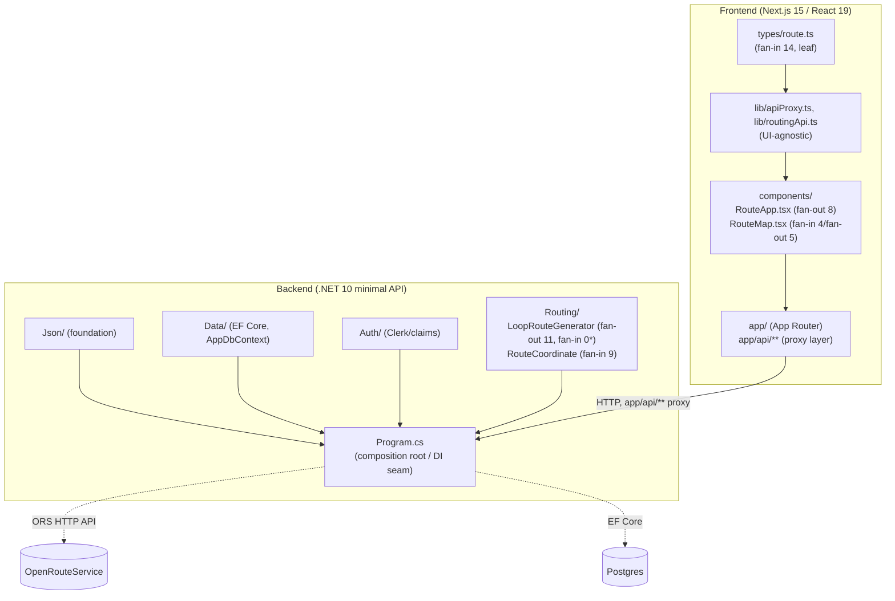

# Repo Map — VeloRoute

Synthesis of `artifact-1-territory.md` (git history), `artifact-2-structure.md` (dependency-cruiser + ArchUnitNET), `artifact-3-contributors.md` (who). Goal: 15 min read → know where things live, what's dangerous, where to start.

## 1. TL;DR

VeloRoute is a loop-route cycling planner: Next.js 15 frontend + .NET 10 minimal-API backend, split over HTTP (no shared runtime). Repo is ~4 months old (started 2026-05-20), single contributor (Łukasz Orawiec, 3 git identities — not a team). Work shifted from building the routing engine (Q3: `backend/Routing`, algorithm) to hardening + v2 (Q4: auth/library/sharing, tests, CI/deploy). Hottest spots: backend `Routing/` + `Program.cs` (composition/DI seam) and frontend `app/` + `components/`. Structurally both sides are clean — zero cycles, layers hold — but git history reveals a coupling invisible to the import graph: `Program.cs` ↔ shared test harness.

*`fan-in 0` for `LoopRouteGenerator`/`OpenRouteServiceClient`/`AppDbContext` is a tooling artifact — actually called from `Program.cs`, see §3.

## 2. Territory

**Deep modules (heavy responsibility, high centrality):**
- `src/backend/VeloRoute/Routing/` — loop-generation algorithm; hottest backend folder (27 file-touches), zero cycles, but `LoopRouteGenerator` has the highest fan-out (11) in the whole backend and is the top-rated risk in `context/foundation/test-plan.md`.
- `src/backend/VeloRoute/Program.cs` — DI/composition root, 14 commits (#2 hottest file), the seam every endpoint change passes through.
- `src/frontend/src/app/` — Next.js App Router, hottest folder in the repo (44 file-touches).
- `src/frontend/src/components/` — 28 file-touches; `RouteApp.tsx` (fan-out 8) and `RouteMap.tsx` (fan-in 4 / fan-out 5) are the structural hubs.

**Shallow/peripheral:** `Json/` and `Auth/` (backend) — stable foundation layers, low churn, zero boundary violations. `types/route.ts` — high fan-in (14, highest in the repo) but a correct leaf (0 outgoing dependencies).

**Activity over time:** only two real quarters of data (repo younger than the nominal 12-month window). Q3 2026 (03-11→06-11): building the routing engine, pre-rename layout (`src/backend/Program.cs` without `VeloRoute/`). Q4 2026 (06-11→09-11, most recent): moved under `VeloRoute/` (project-rename), v2 (auth/library/share), a jump in test investment (`VeloRoute.Tests` +38) and CI (`.github/workflows/backend.yml` +13). Trend: engine-first → ship-and-iterate.

**Where directory structure doesn't match activity:** `.github/skills/10x-bootstrapper` and `.github/skills/10x-tech-stack-selector` rank high on file-touches (19, 15) but that's 3 commits total — scaffold + delete, not sustained work. Both directories **no longer exist** (consolidated into `.claude/skills/`). Don't treat as a hotspot.

## 3. Real couplings

What actually changes together, and how we know:

| Coupling | Strength | Source | Type |
|---|---|---|---|
| `Program.cs` ↔ `VeloRoute.Tests/Routing` | 12 commits | git co-change (artifact-1) | Manual edit — a new endpoint usually drags a `Routing/` change and its tests along |
| `Program.cs` ↔ `TestInfrastructure.cs` (shared harness) | 6 commits (>50% of `Program.cs`'s own commits) | git co-change, file-level (artifact-1) | Manual edit, **coupling smell** — the harness doesn't stay stable across unrelated endpoint changes |
| `app/` ↔ `components/` ↔ `types/` (frontend triangle) | 10/5/5 commits | git co-change (artifact-1) | Manual edit; dependency-cruiser confirms: **clean DAG, not a cycle** (0 violations of `types-are-foundation`) |
| `app/api/**` ↔ backend `Program.cs` | 8 commits | git co-change (artifact-1) | Manual edit — the expected full-stack seam (proxy layer, confirmed by the `api-routes-no-components` rule: the proxy doesn't import UI) |
| `roadmap.md` ↔ almost everything | dominant common denominator | git co-change (artifact-1) | **Not code** — a ledger updated out of workflow discipline (documented in `copilot-instructions.md`), not a real architectural coupling |
| `README.md` ↔ `AGENTS.md` ↔ `copilot-instructions.md` ↔ per-component READMEs | smaller cluster | git co-change (artifact-1) | Doc-sync commits, convention, not code |

**Layers and cycles — tool-confirmed:**
- Frontend (dependency-cruiser, `src/frontend/src` only — **backend out of scope for this tool, different language**): 0 cycles in first-party code; 3 layer-boundary rules (`types` imports nothing above it, `lib` ↛ `components`, `app/api` ↛ `components`) — all **hold**.
- Backend (ArchUnitNET, xUnit-based; **no .NET equivalent of dependency-cruiser's import graph** — covered by pass/fail rules + a custom PowerShell script for metrics): 4 namespaces (`Data`, `Routing`, `Auth`, `Json`) — zero cross-namespace dependencies, zero cycles (`Top_Level_Namespaces_Are_Free_Of_Cycles` — pass). This **resolves** the question left open by the frontend section: `Program.cs` ↔ `TestInfrastructure.cs` is **not a namespace cycle** — ArchUnitNET only reasons about types/namespaces, so it can't rule out a file-to-file coupling in the test harness specifically.
- **Tooling artifact, not dead code**: `LoopRouteGenerator`, `OpenRouteServiceClient`, `AppDbContext` show fan-in=0 in the static IL graph because ArchUnitNET/Cecil drops `Program.cs` (top-level statements, compiler-generated). A text-scan mitigation confirms all three are actually called from `Program.cs` (`ReferencedByCompositionRoot: true`). This echoes the same co-change signal from git history (`Program.cs` is the seam) — two independent tools agree on where the seam is, even though neither sees the seam directly.

**A layer with no dependency graph = `unknown`, not "no couplings":** CI/deploy (`.github/workflows/*`, Kudu migration steps, PowerShell/YAML) has no coverage from either tool (not JS/TS, not a compiled .NET type graph). Couplings there are known only from git history (artifact-1): five consecutive `fix(ci-deploy-hardening)` commits on the Kudu migration step signal fragility, but that's `unknown` for structural coupling — nobody has import-mapped it.

## 4. Risk zones

1. **`LoopRouteGenerator` / `Routing/`** — highest fan-out (11) in the backend, zero fan-in in the static graph (only reached via DI/`Program.cs`), and the top-rated risk in `context/foundation/test-plan.md`. A change to the algorithm has a blast radius the static graph can't see.
2. **`TestInfrastructure.cs`** — shared test harness touched on >50% of `Program.cs`'s commits; you can't touch an endpoint without risking a harness edit. Debt, not a maintained abstraction.
3. **Kudu migration step in CI** (`ci-deploy-hardening`) — five targeted fixes in a row (VFS PUT, shell spawn, cookie persistence, base64 padding, secret scrubbing). No tool coverage (outside JS/TS and the .NET type graph) = high risk of silent regression.
4. **`RouteApp.tsx` / `RouteMap.tsx`** — frontend structural hubs (fan-out 8; fan-in 4/fan-out 5) that line up with git-history hotness. `RouteMap.tsx` also borders an external, stateful library (`@vis.gl/react-maplibre`) that's hard to mock cleanly.
5. **`Program.cs` as composition root** — every new endpoint/feature slice passes through this file; no controllers means no natural split of responsibility, all DI wiring in one place.
6. **Single contributor, no bus factor** — all knowledge (algorithm, Kudu fragility, DI wiring) lives in one head; no second person for review or escalation.

## 5. Who to ask

The repo has **one contributor** (Łukasz Orawiec, 3 git identities — not 3 people). "Who to ask" here means **which commit trail to read**, not who to escalate to.

| Zone | Candidate / trail |
|---|---|
| Backend routing core (`Routing/`) | Łukasz Orawiec — `feat(loop-route-generation)`, `feat(routing): improve loop route quality`, `fix(routing-api-wiring): impl-review fixes` |
| `Program.cs` / DI wiring | Łukasz Orawiec — feature-slice commits F-01…S-08, `chore(project-rename): backend rename` |
| Frontend `app`/`components` | Łukasz Orawiec — UI build-out per feature slice, `fix: SearchBar keyboard/reopen bugs (#18)` |
| `TestInfrastructure.cs` | Łukasz Orawiec — the only person who has extended it (8 incidental commits) |
| CI/deploy (Kudu) | Łukasz Orawiec — `feat(ci-deploy-hardening): migration-in-CI via Kudu`, 5 follow-up fixes |

## 6. First day — what to read

1. `context/foundation/prd-v2.md` — current scope (not `prd.md`, that's the frozen v1).
2. `context/foundation/roadmap.md` — cross-cutting ledger, most-changed file in the repo; shows what's done vs. remaining.
3. `src/backend/VeloRoute/Program.cs` — composition root, the seam for every backend change.
4. `src/backend/VeloRoute/Routing/LoopRouteGenerator.cs` — highest risk, highest fan-out; the heart of the product.
5. `src/frontend/src/components/RouteApp.tsx` — client-side orchestrator, frontend structural hub.
6. `src/frontend/src/types/route.ts` — the data contract between layers (highest fan-in in the repo).
7. `src/backend/VeloRoute.Tests/Routing/TestInfrastructure.cs` — understand the debt before you touch it.
8. `.github/copilot-instructions.md` — workflow conventions (branch-per-change, doc-sync obligations).

## 7. Limitations

- **Time window**: full repo history is ~4 months (2026-05-20 → 2026-09-10), shorter than the nominal 12-month window — two of four quarters are empty (repo didn't exist yet).
- **Method**: git co-change (commit-level, not semantic) for "what changes together"; dependency-cruiser for the frontend import graph; ArchUnitNET (pass/fail rules) + a custom PowerShell/Cecil script for the backend (namespace-level, not file-level).
- **What this map does NOT say**: nothing about CI/deploy as a dependency graph — `unknown`, unmapped by either tool (outside JS/TS and the .NET type graph), only git history. Nothing about runtime behavior (static structure + edit history only). `Program.cs`'s fan-in=0 for three types is a tooling artifact (top-level statements dropped by Cecil), corrected by a text scan, not IL-verified. The backend has no equivalent of the frontend's `--reaches`/full import graph — ArchUnitNET only answers yes/no on defined rules.
- The repo has a single contributor — the "who to ask" section is formally moot; its value is in *which commit trail to read*, not in routing to a second person.
